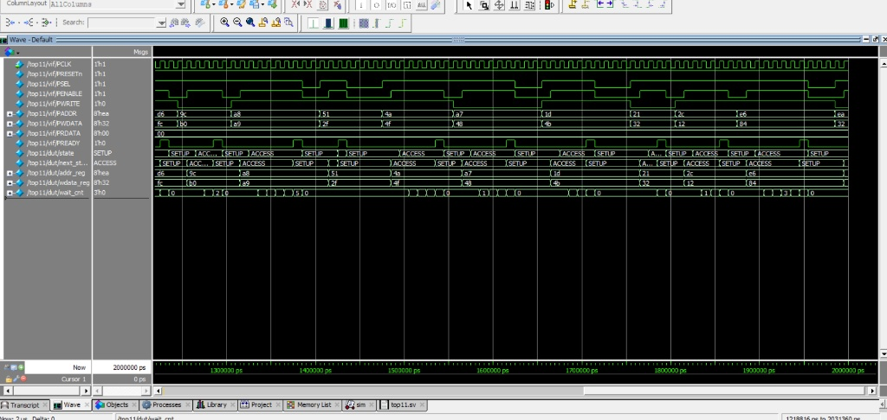

# APB Protocol Verification Environment

## Overview

This repository implements a professional **AMBA APB (Advanced Peripheral Bus)** Verification Environment using **SystemVerilog** and **QuestaSim**.

The project demonstrates a complete Design Verification (DV) flow focused on:
- Protocol compliance
- Bus timing verification
- Randomized stress testing
- Self-checking verification infrastructure

The environment verifies an APB Slave RTL against AMBA APB specifications using assertions, coverage, scoreboard checking, and randomized transactions.

---

## Key Features

- **FSM-based APB Slave Design**
- **Randomized Wait-State Modeling**
- **Back-to-Back Transfers**
- **Automated Scoreboard Verification**
- **Assertion-Based Verification (SVA)**
- **Functional Coverage Collection**
- **Mailbox-Based Verification Environment**
- **Randomized Read/Write Transaction Generation**

---

## Verification Architecture

| Component | Responsibility |
|---|---|
| **APB Driver** | Generates constrained-random APB transactions |
| **APB Monitor** | Captures APB bus activity |
| **Scoreboard** | Compares expected vs actual data |
| **Assertions (SVA)** | Validates APB protocol timing rules |
| **Coverage** | Tracks verification completeness |
| **Environment** | Connects all verification components |

---

## APB Protocol Features Verified

- [x] SETUP → ACCESS transition timing
- [x] PENABLE assertion/de-assertion correctness
- [x] Address/Data stability during randomized wait states
- [x] Read/Write transaction integrity
- [x] Seamless back-to-back transfer operation
- [x] Randomized wait-state behavior

---

## Simulation Waveform

The waveform below demonstrates:
- Randomized wait-state insertion
- Continuous APB traffic
- Back-to-back transactions
- FSM state transitions
- Read/Write operations



*Figure 1: APB protocol timing with randomized PREADY wait-state behavior.*

---

## Project Structure

```text
APB-protocol-verification-env/
│
├── interface/
│   └── apb_if1.sv
│
├── rtl/
│   └── apb_slave1.sv
│
├── tb/
│   ├── apb_txn1.sv
│   ├── apb_driver1.sv
│   ├── apb_monitor1.sv
│   ├── apb_scoreboard1.sv
│   ├── apb_assertions.sv
│   ├── apb_coverage.sv
│   ├── apb_env.sv
│   └── top11.sv
│
├── sim/
│   └── run.do
│
├── README.md
│
└── APB_Waveform.jpg
```

---

## Simulation Commands

Run the following commands in QuestaSim:

```tcl
vdel -all

vlib work
vmap work work

vlog -cover bcst top11.sv

vsim top11 -voptargs=+acc

add wave -group APB_BUS top11/vif/PCLK
add wave -group APB_BUS top11/vif/PRESETn
add wave -group APB_BUS top11/vif/PSEL
add wave -group APB_BUS top11/vif/PENABLE
add wave -group APB_BUS top11/vif/PWRITE
add wave -group APB_BUS top11/vif/PADDR
add wave -group APB_BUS top11/vif/PWDATA
add wave -group APB_BUS top11/vif/PRDATA
add wave -group APB_BUS top11/vif/PREADY

add wave -group FSM top11/dut/state
add wave -group FSM top11/dut/next_state

add wave -group INTERNAL top11/dut/addr_reg
add wave -group INTERNAL top11/dut/wdata_reg
add wave -group INTERNAL top11/dut/wait_cnt

run 1000
```

---

## Tools Used

- SystemVerilog
- QuestaSim
- Assertion-Based Verification
- Functional Coverage
- Mailbox-Based Verification

---

## Future Improvements

- UVM-Based APB Agent
- PSLVERR Support
- APB-to-UART Integration
- APB-to-FIFO Verification
- Advanced Functional Coverage
- Error Injection Testing

---

## Author

**Sindhu Hegde**
